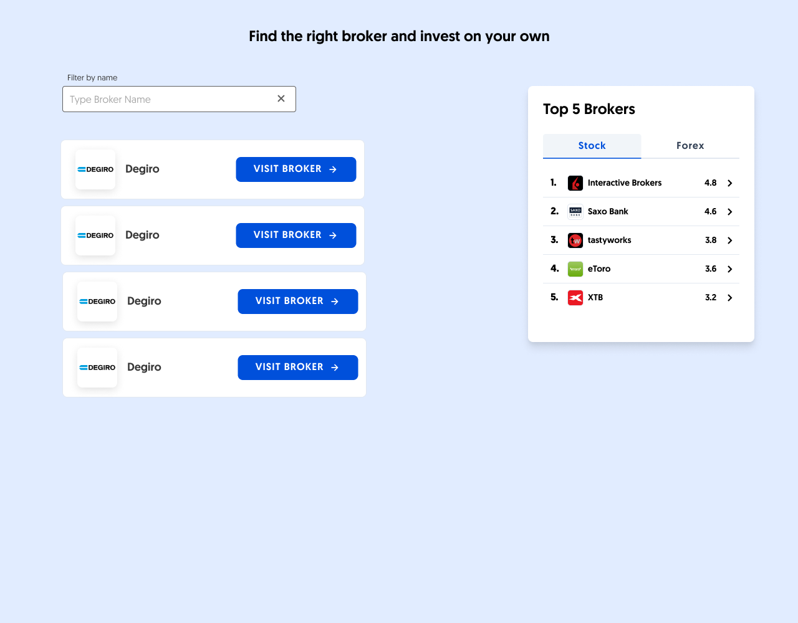
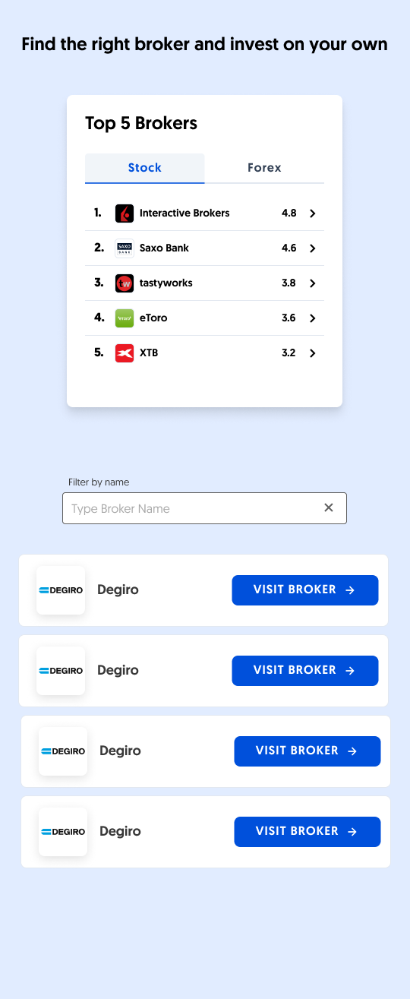

## BrokerChooser Senior Frontend Developer Homework

Congratulations on getting to this part of our interview process!

Here you can find a starter NextJS project where you can implement the following task. (NextJS was only used for easy setup, no SSR is needed.)

Your task is to implement the following page:

#### Desktop view:


#### Mobile view:



This page consists of 2 main parts:
1) A broker list that can be filtered using by name using the input above it. The list updates dynamically based on the user input. The blue buttons are redirecting the user to the link `linkUrl` opening in a new page. All brokers are shown for empty search field.
2) A box that features 2 tabs that show the top 5 brokers in each category. The row themselves can be clicked, which behaves just like the blue button on the row item from the search list.   

Besides creating a functional implementation of the design (you can find the required data in the [brokers.ts](./src/data/brokers.ts)) file, we would also like to measure the user interactions on the page.

### Events

We would like to measure the `impression` and the `click` events of each ui element that redirects the user to `linkUrl` (Blue button and Top 5 Box row.). `impression` is triggered when the ui item is visible to the user (check out [`IntersectionObserver`](https://developer.mozilla.org/en-US/docs/Web/API/Intersection_Observer_API)) and `click` event is sent on click. Each source has its unique `MeasurementId` (see [event.ts](./src/logic/event.ts)) to identify the source of the event.

#### Requirements

- event calls should just call `sendEvent`  (defined in   [event.ts](./src/logic/event.ts))
- for each [`MeasurementId`, `BrokerId`, `event type`] triple there should be only one event sent out per page load. See examples below:
  - Interactive Brokers appears when the filter is empty, an `impression` event is sent
  - if a broker reappears in the list when the search changes, no `impression` event should be sent

## Evaluation

What we are looking for:

- clear code structure
- usage of TypeScript and Redux
- architecture of impression handling

Other:

- you can use third party libraries as you see fit

## Project

Run the development server:

```bash
npm run dev
# or
yarn dev
```
